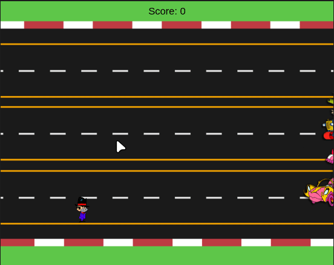

# Corrida Maluca

Projeto ilustrativo criado no curso [Lógica de programação: laços e listas com JavaScript](https://cursos.alura.com.br/course/javascript-listas-lacos), na [Alura](https://www.alura.com.br).

Este jogo é desenvolvido pelo professor no decorrer do curso, no entanto, algumas coisas foram alteradas.

Como primeiro jogo, o sentimento foi de empolgação e, por isto, este foi adicionado aqui.

  

## Como rodar

Este foi desenvolvido no [p5.js Web Editor](https://editor.p5js.org/). Caso queira alterar, basta criar um projeto no mesmo, importando os arquivos.